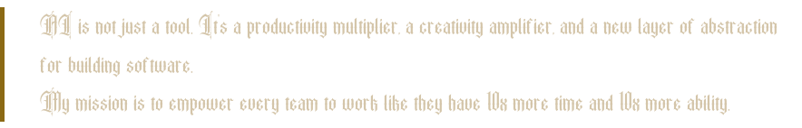
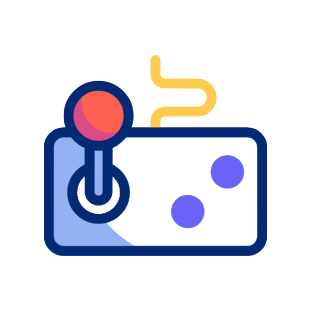
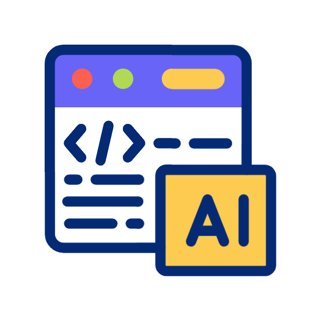
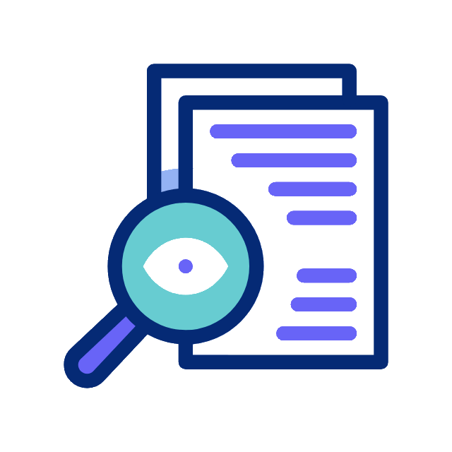

  

  

### Head of AI · Head of Delivery & QA | Site Management @ Securitize AI Innovator · Multi-Agent Systems Builder · Automation Architect

  
  <b style="font-size: 1.35em; margin-left: 10px;">Let's Connect</b>

  
  
  
  

 

  
  
  
  
  

---

  
  <b style="font-size: 1.35em; margin-left: 10px;">Philosophy</b>

  

---

  
  <b style="font-size: 1.35em; margin-left: 10px;">About Me</b>

QA, Delivery & AI leader with 20+ years in QA and delivery and 3+ years in AI development, driving efficiency, scalability, and quality across complex, global software programs, from hands-on QA automation at Plarium and Safecharge to leading Site Management, R&D delivery, and company-wide AI adoption at Securitize today. I bring deep managerial experience leading cross-functional R&D and multi-site teams, aligning release strategies to business goals, and building robust QA, delivery, and AI infrastructures.

A forward-thinking AI implementor, I leverage intelligent automation, multi-agent AI systems, and data-driven tools to streamline QA, optimize delivery workflows, and elevate team performance. I operate with clear OKRs and KPIs for continuous monitoring, ensuring visibility, accountability, and measurable outcomes throughout the delivery lifecycle.

<strong><ins>Head of Delivery & QA</ins></strong>

✔ Own end-to-end release workflows and change management for R&D across three locations, with OKRs/KPIs driving accountability and measurable performance

✔ Design and optimize Agile, SDLC, and QA methodologies. Coordinate releases with architects, POs, and infra teams and lead weekly stakeholder forums

✔ Build and scale QA infrastructure and automation (Selenium/Java, K8s) across a multi-site department with hands-on technical mentoring

✔ Administer JIRA SDLC flows and apply AI to streamline testing, delivery, and day-to-day QA productivity

<strong><ins>Head of AI</ins></strong>

✔ Lead company-wide AI through a Dual-Track model. Embed AI into everyday workflows (Track 1) and channel governed initiatives to the Data & AI team (Track 2)

✔ Discover, prioritize, and drive adoption of practical AI use cases. Build fluency via roundtables, OpenAI Academy, playbooks, and responsible usage standards

✔ Deliver tailored AI solutions across R&D, Ops, Product, Marketing, and QA. Manage tooling lifecycle from POC to enterprise and track impact via Jira velocity and cycle time

---

  
  <b style="font-size: 1.35em; margin-left: 10px;">Featured</b>

Professional tools and platforms built for real-world impact.

<table>
<tr>
<td width="50%" valign="top">

**[Autonoma](https://github.com/ponya5/Autonoma)**
Autonomous, state-aware web security crawler that maps every page and interactive element of an app, tests each one for functional bugs and OWASP vulnerabilities, and reports findings through a live React control console.

</td>
<td width="50%" valign="top">

**[FormGuard](https://github.com/MisterSponz/FormGuard)**
Automated verification tool for investor subscription and tax forms (W-8BEN, W-8BEN-E, W-9, and more). Batch upload, AWS Textract OCR, and intelligent validation that saves hours of manual review work on every cycle.

</td>
</tr>
<tr>
<td width="50%" valign="top">

**[Social Stash](https://socialstash.me/)**
Personal social-media content organizer that saves and categorizes posts across X, LinkedIn, Instagram, YouTube, TikTok, and Facebook, with favorites, search, and a PWA install. 1,000+ registered users.

</td>
<td width="50%" valign="top">

**[PathPilot (Monorepo)](https://github.com/MisterSponz/PathPilot)**
Unified ecosystem of AI apps for education, analytics, and automation including Course Analyzer, AI Feedz, Training Tracker, and Log Monitor, sharing a common auth/config/UI foundation.

</td>
</tr>
<tr>
<td width="50%" valign="top">

**[PathPilot Tutorial Generator](https://github.com/ponya5/PathPilot-Tutorial-Generator)**
End-to-end AI video pipeline that turns any topic into a fully produced tutorial (script → visuals → narration → MP4) by chaining GPT-4, DALL-E 3, and ElevenLabs, orchestrated through a Next.js review UI.

</td>
<td width="50%" valign="top">

**[Large-Scale Document Migration Tool](https://github.com/ponya5/SFS_Migration_Tool)**
Full-stack document automation tool for bulk financial-document retrieval from web portals with Playwright-driven downloads, customizable filtering, and optional AWS S3 integration.

</td>
</tr>
<tr>
<td width="50%" valign="top">

**[ClaudeGhost](https://github.com/ponya5/ClaudeGhost)**
Headless supervisor for the Claude Code CLI that runs Claude autonomously with configurable autonomy levels, approves/blocks risky commands from your phone via Telegram, and shows a live Rich terminal dashboard.

</td>
</tr>
</table>

---

  
  <b style="font-size: 1.35em; margin-left: 10px;">Fun Projects</b>

Side projects, experiments, and creative builds.

<table>
<tr>
<td width="50%" valign="top">

**[The Tokenizer, Rise of the Ledgers](https://thetokenizer.online/)**
Retro 2D platform shooter through crypto-tokenization history (2017 to 2025) with 6 historical eras, boss battles, and a global leaderboard, built entirely in vanilla JS + HTML5 Canvas.

</td>
<td width="50%" valign="top">

**[Take Your Time (IDE Arcade)](https://github.com/ponya5/TakeYourTime_IDE_Arcade)**
VS Code extension that turns idle build/AI-agent wait time into arcade breaks. Launches sandboxed game tabs right inside the IDE without interrupting your work.

</td>
</tr>
<tr>
<td width="50%" valign="top">

**[Trip Planner Dashboard](https://github.com/ponya5/trip-planner-dashboard)**
A Claude/Cursor AI skill that turns "plan me a trip" into one self-contained HTML dashboard with a live-routed map, animated drive playback, itinerary, hotels, budget, and safety fallbacks. No server, no API key, no build.

</td>
<td width="50%" valign="top">

**[VDock2 | Virtual Stream Deck](https://github.com/ponya5/VDock2)**
Browser-based control deck for custom button layouts, workflow automation, and live system monitoring with 26+ animated dashboard backgrounds included.

</td>
</tr>
</table>

  

---

  
  <b style="font-size: 1.35em; margin-left: 10px;">Tech Stack</b>

**Code**

**Automation**

**Infrastructure**

---

  
  <b style="font-size: 1.35em; margin-left: 10px;">Currently Exploring</b>

- Multi-agent planning, delegation, and memory
- Autonomous engineering teams
- AI-driven audio & video generation workflows
- Real-time multimodal reasoning
- Universal AI dashboards for enterprises

---

  
  <b style="font-size: 1.35em; margin-left: 10px;">Certifications</b>

### 🧠 Nebius Academy, AI Performance Engineering Fellowship (2026)

<table>
<tr>
<td align="center" width="16.6%">
 
<b>Fellowship</b> Dec 2026
</td>
<td align="center" width="16.6%">
 
<b>AI Leader</b> Aug 2026
</td>
<td align="center" width="16.6%">
 
<b>AI Agents</b> Jun 2026
</td>
<td align="center" width="16.6%">
 
<b>Performance Eng.</b> Sep 2026
</td>
<td align="center" width="16.6%">
 
<b>LLM Post-Training</b> Oct 2026
</td>
<td align="center" width="16.6%">
 
<b>MLOps</b> Jul 2026
</td>
</tr>
</table>

A full-stack AI engineering fellowship covering LLM internals & post-training (RLHF, RLVR, SFT), agentic systems on top of third-party APIs (multi-agent systems, RAG, LLM APIs), performance engineering (CUDA, custom kernels, quantization, speculative decoding), and MLOps (experiment management, deployment, monitoring, scaling), capped by the **Nebius AI Leader** certification for AI product strategy and vendor evaluation.

### 🧠 AI Agents Fundamentals

**Issuer** Hugging Face · **Issued** Sep 2025 · **Credential ID** ponya5

[🔗 Show Credential](https://huggingface.co/datasets/agents-course/certificates/resolve/main/certificates/ponya5/2025-09-20.png)

### 🤖 Generative AI for Everyone

**Issuer** DeepLearning.AI (via Coursera) · **Completed** Sep 17, 2025

[🔗 Show Credential](https://www.coursera.org/account/accomplishments/records/WWTJ0Z0A8Q4A)

### 💻 Professional Software Developer Certification for .NET

**Issuer** John Bryce · **Issued** Oct 2017

### 📊 Certified Systems Analyst (CSA)
**Issuer** The Israel Chamber of Information Systems Analysts · **Issued** Sep 2013

Also, 10+ years as a proficient Jira Administrator

---

  
  <b style="font-size: 1.35em; margin-left: 10px;">Fun Facts</b>

- I build AI tools at 1 AM because that's when the best ideas arrive
- I test every new model the minute it launches
- I enjoy turning prompts into full apps and pipelines
- If something requires automation, I'll automate it
- My motto is "Move fast. Build smart. Automate everything."

---

Thanks for visiting! 🚀
