# 🌐 Daniel Shalom

  

### Head of AI & Delivery/QA | Site Management @ Securitize AI Innovator · Multi-Agent Systems Builder · Automation Architect

## 📫 Let's Connect

  
  
  
  

 

  
  
  
  
  

---

## 🧑‍🚀 About Me

QA & Delivery leader with 15+ years driving efficiency, scalability, and quality across complex, global software programs — from hands-on QA automation at Plarium and Safecharge to leading Site Management and Agentic AI Development at Securitize today. I bring deep managerial experience leading cross-functional R&D and multi-site teams, aligning release strategies to business goals, and building robust QA and delivery infrastructures.

A forward-thinking AI implementor, I leverage intelligent automation, multi-agent AI systems, and data-driven tools to streamline QA, optimize delivery workflows, and elevate team performance. I operate with clear OKRs and KPIs for continuous monitoring, ensuring visibility, accountability, and measurable outcomes throughout the delivery lifecycle.

✔ Strategic oversight of global R&D deliveries, consistently achieving pipeline and milestone objectives

✔ Deep expertise in Agile, SDLC, and release management processes tailored to fast-paced development environments

✔ Experienced Scrum Master with hands-on experience rolling out Scrum practices across distributed teams

✔ Proven ability to scale and guide QA teams, from daily execution to performance reviews

✔ Extensive experience building QA infrastructures from the ground up, including automation frameworks (Java, Selenium)

✔ AI-Driven Delivery Optimization: leveraging AI-powered tools and agent-based systems to automate testing, reduce release friction, and enable real-time insights and decision support

---

## 🔥 Featured

<table>
<tr>
<td width="50%" valign="top">

**[VDock2 — Virtual Stream Deck](https://github.com/ponya5/VDock2)**
Browser-based control deck for custom button layouts, workflow automation, and live system monitoring — 26+ animated dashboard backgrounds included.

<a href="assets/vdock2-demo.gif">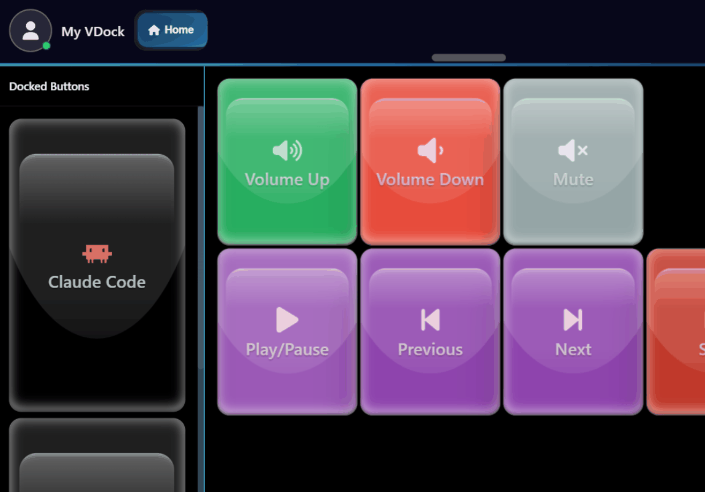</a>

</td>
<td width="50%" valign="top">

**[Trip Planner Dashboard](https://github.com/ponya5/trip-planner-dashboard)**
A Claude/Cursor AI skill that turns "plan me a trip" into one self-contained HTML dashboard — live-routed map with animated drive playback, itinerary, hotels, budget, and safety fallbacks. No server, no API key, no build.

<a href="assets/trip-planner-demo.gif">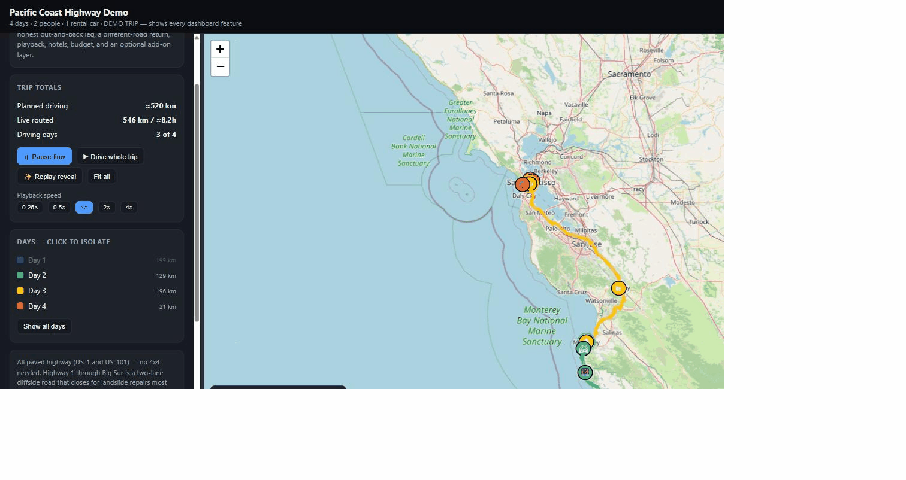</a>

</td>
</tr>
<tr>
<td width="50%" valign="top">

**[Social Stash](https://github.com/ponya5/socialstash)**
Personal social-media content organizer — save and categorize posts across X, LinkedIn, Instagram, YouTube, TikTok, and Facebook, with favorites, search, and a PWA install. 1,000+ registered users.

<a href="assets/socialstash-demo.gif">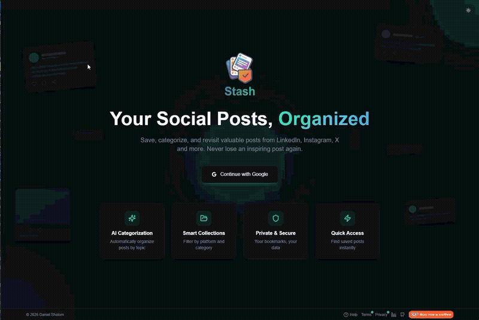</a>

</td>
<td width="50%" valign="top">

**[Beacon](https://github.com/ponya5/beaconai)**
Free, Hebrew-language platform aggregating every major Israeli tech event — conferences, webinars, meetups — into one searchable, weekly-updated dashboard with filters and calendar view.

<a href="assets/beacon-demo.gif">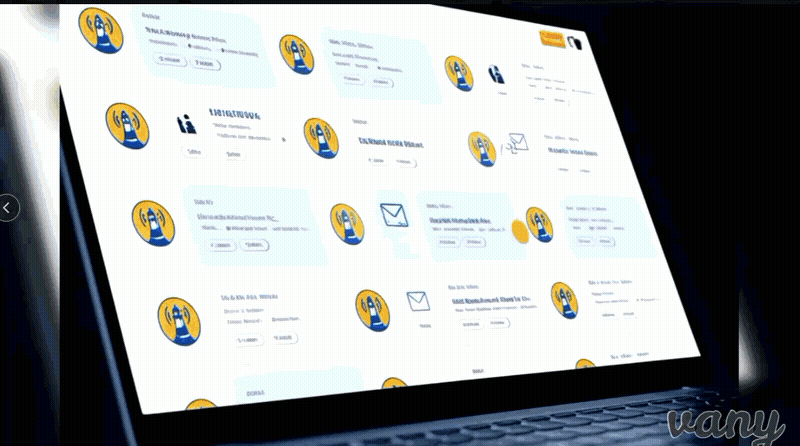</a>

</td>
</tr>
<tr>
<td width="50%" valign="top">

**[PathPilot Tutorial Generator](https://github.com/ponya5/PathPilot-Tutorial-Generator)**
End-to-end AI video pipeline — turns any topic into a fully produced tutorial (script → visuals → narration → MP4) by chaining GPT-4, DALL-E 3, and ElevenLabs, orchestrated through a Next.js review UI.

</td>
<td width="50%" valign="top">

**[PathPilot (Monorepo)](https://github.com/MisterSponz/PathPilot)**
Unified ecosystem of AI apps for education, analytics, and automation — Course Analyzer, AI Feedz, Training Tracker, and Log Monitor, sharing a common auth/config/UI foundation.

</td>
</tr>
<tr>
<td width="50%" valign="top">

**[The Tokenizer: Rise of the Ledgers](https://github.com/ponya5/Tokenizer)**
Retro 2D platform shooter through crypto-tokenization history (2017–2025) — 6 historical eras, boss battles, and a global leaderboard, built entirely in vanilla JS + HTML5 Canvas.

<a href="assets/tokenizer-demo.gif">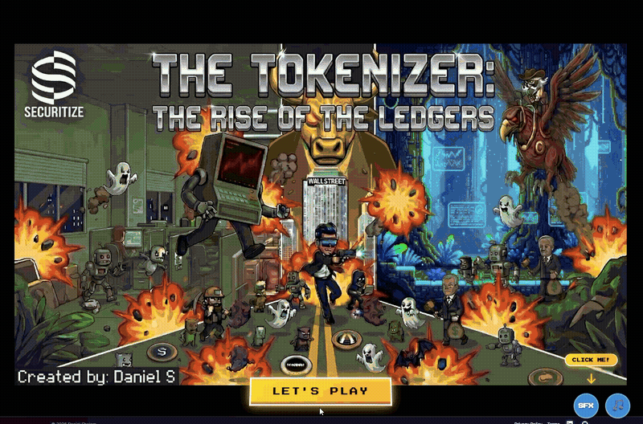</a>

</td>
<td width="50%" valign="top">

**[Take Your Time (IDE Arcade)](https://github.com/ponya5/TakeYourTime_IDE_Arcade)**
VS Code extension that turns idle build/AI-agent wait time into arcade breaks — launches sandboxed game tabs right inside the IDE without interrupting your work.

<a href="assets/takeyourtime-demo.gif">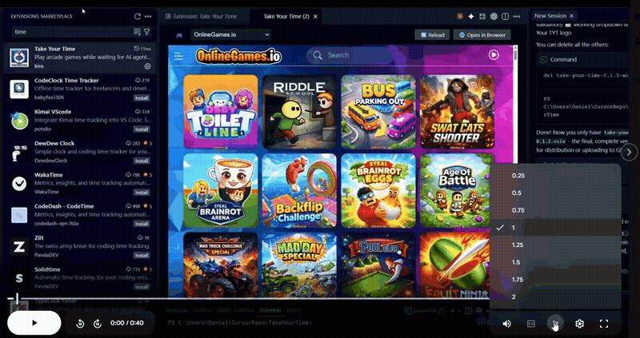</a>

</td>
</tr>
<tr>
<td width="50%" valign="top">

**[Autonoma](https://github.com/ponya5/Autonoma)**
Autonomous, state-aware web security crawler — maps every page and interactive element of an app, tests each one for functional bugs and OWASP vulnerabilities, and reports findings through a live React control console.

<a href="assets/autonoma-screenshot.png">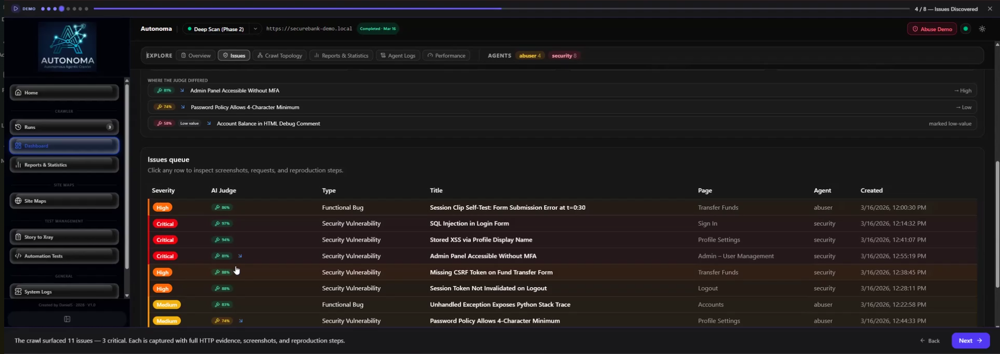</a>

</td>
<td width="50%" valign="top">

**[Large-Scale Document Migration Tool](https://github.com/ponya5/SFS_Migration_Tool)**
Full-stack document automation tool for bulk financial-document retrieval from web portals — Playwright-driven downloads, customizable filtering, and optional AWS S3 integration.

<a href="assets/sfs-migration-screenshot.png">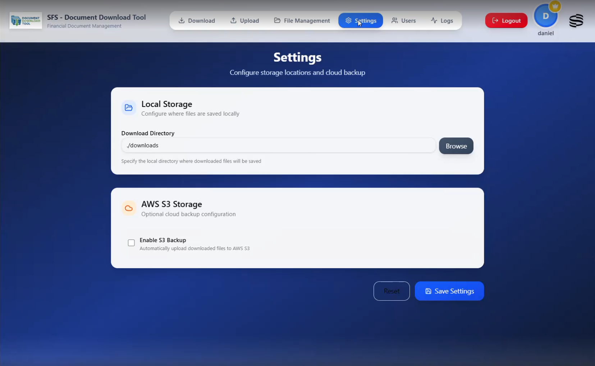</a>

</td>
</tr>
<tr>
<td width="50%" valign="top">

**[ClaudeGhost](https://github.com/ponya5/ClaudeGhost)**
Headless supervisor for the Claude Code CLI — runs Claude autonomously with configurable autonomy levels, approves/blocks risky commands from your phone via Telegram, and shows a live Rich terminal dashboard.

<a href="assets/claudeghost-demo.gif">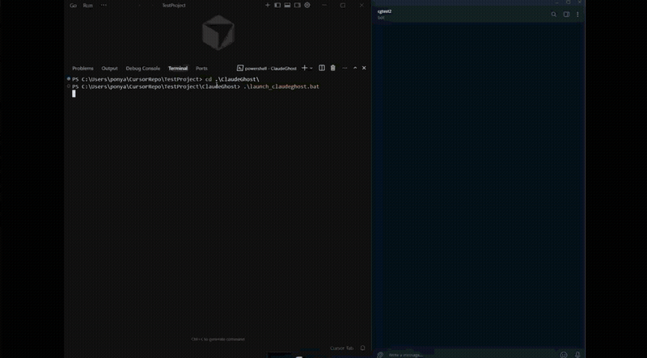</a>

</td>
<td width="50%" valign="top" align="center">

</td>
</tr>
</table>

---

## 🛠️ Tech Stack

---

## 🧠 Philosophy

AI is not just a tool. It's a productivity multiplier, a creativity amplifier, and a new layer of abstraction for building software.

My mission: empower every team to work like they have 10x more time and 10x more ability.

---

## 🌱 Currently Exploring

- Multi-agent planning, delegation, and memory
- Autonomous engineering teams
- AI-driven audio & video generation workflows
- Real-time multimodal reasoning
- Universal AI dashboards for enterprises

---

## 🤖 AI Activities

### 🏢 At Securitize — [www.securitize.io](https://www.securitize.io)
- Leading internal AI adoption across departments
- Creating the Securitize AI Hub (tools, licenses, dashboards, events, policies)
- Designing workflows that make employees far more productive
- Building AI-powered onboarding, license optimization, Slack bot automations, Drata/Jira compliance workflows, and internal GPT tools for BD, Marketing, Engineering, and QA

---

## 📜 Certifications & Education

### 🧠 Nebius Academy — AI Performance Engineering Fellowship (2026)

<table>
<tr>
<td align="center" width="16.6%">
<a href="https://www.credly.com/org/nebius-academy/badge/ai-performance-engineering-program-completed-badge">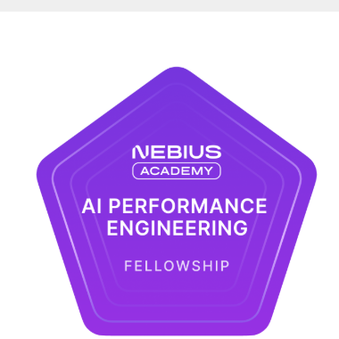</a> 
<b>Fellowship</b> Dec 2026
</td>
<td align="center" width="16.6%">
<a href="https://www.credly.com/org/nebius-academy/badge/nebius-agentic-ai-builder-certification">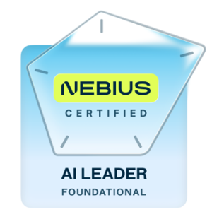</a> 
<b>AI Leader</b> Aug 2026
</td>
<td align="center" width="16.6%">
<a href="https://www.credly.com/org/nebius-academy/badge/ai-agents-course-completed-badge">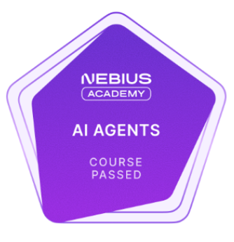</a> 
<b>AI Agents</b> Jun 2026
</td>
<td align="center" width="16.6%">
<a href="https://www.credly.com/org/nebius-academy/badge/performance-engineering-course-completed-badge">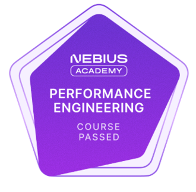</a> 
<b>Performance Eng.</b> Sep 2026
</td>
<td align="center" width="16.6%">
<a href="https://www.credly.com/org/nebius-academy/badge/llm-post-training-course-completed-badge">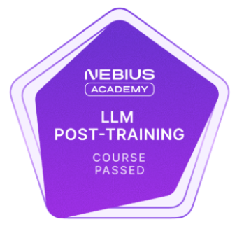</a> 
<b>LLM Post-Training</b> Oct 2026
</td>
<td align="center" width="16.6%">
<a href="https://www.credly.com/org/nebius-academy/badge/mlops-course-completed-badge">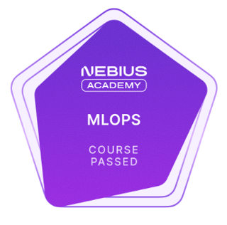</a> 
<b>MLOps</b> Jul 2026
</td>
</tr>
</table>

A full-stack AI engineering fellowship covering LLM internals & post-training (RLHF, RLVR, SFT), agentic systems on top of third-party APIs (multi-agent systems, RAG, LLM APIs), performance engineering (CUDA, custom kernels, quantization, speculative decoding), and MLOps (experiment management, deployment, monitoring, scaling) — capped by the **Nebius AI Leader** certification for AI product strategy and vendor evaluation.

### 🤖 Nebius Agentic AI Builder Certification

**Issuer:** Nebius Academy · **Type:** Certification · **Level:** Intermediate · **Paid**

[🔗 Show Credential](https://www.credly.com/badges/4bcfb2c9-40de-4774-8c3b-814ba132aa0d/linked_in?t=tk8808)

Nebius Agentic AI Builder is a professional able to create AI-powered workflows and applications by integrating AI models via Nebius Token Factory. They build end-to-end agentic workflows and RAG pipelines, apply fine-tuning techniques, and connect agents to external systems such as Tavily web search and other tools.

### 🧠 AI Agents Fundamentals

**Issuer:** Hugging Face · **Issued:** Sep 2025 · **Credential ID:** ponya5

[🔗 Show Credential](https://huggingface.co/datasets/agents-course/certificates/resolve/main/certificates/ponya5/2025-09-20.png)

### 🤖 Generative AI for Everyone

**Issuer:** DeepLearning.AI (via Coursera) · **Completed:** Sep 17, 2025

[🔗 Show Credential](https://www.coursera.org/account/accomplishments/records/WWTJ0Z0A8Q4A)

### 💻 Professional Software Developer Certification – .NET

**Issuer:** John Bryce · **Issued:** Oct 2017

### 📊 Certified Systems Analyst (CSA)
**Issuer:** The Israel Chamber of Information Systems Analysts · **Issued:** Sep 2013

Also: 10+ years as a proficient Jira Administrator

---

## ⚡ Fun Facts

- I build AI tools at 1:00 AM because that's when the best ideas arrive
- I test every new model the minute it launches
- I enjoy turning prompts into full apps and pipelines
- If something requires automation, I'll automate it
- My motto: "Move fast. Build smart. Automate everything."

---

Thanks for visiting! 🚀
