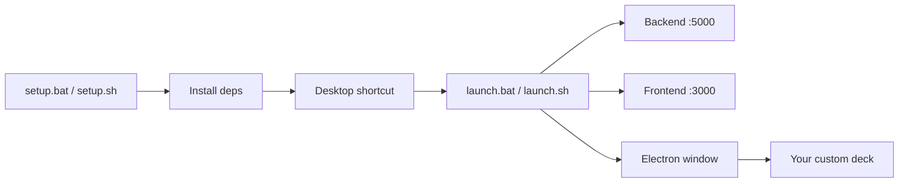

<div align="center">


<br />


<br />

[](LICENSE)
[](README.md)
[](frontend/)
[](backend/)

**Your customizable control deck — buttons, scenes, system actions, widgets, and animated backgrounds in one beautiful interface.**

[Quick Start](#-quick-start) · [Features](#-features) · [Setup Menu](#-one-setup-for-everything) · [Creator](#-creator) · [Docs](docs/) · [Issues](https://github.com/ponya5/VDock2/issues)

</div>

---

## What is VDock?

VDock is a **virtual stream deck** for your computer. Build button grids for everyday tasks — launch apps, run hotkeys, control volume, monitor CPU/GPU, switch OBS scenes, show weather, and more.

Use it as a **desktop app (Electron)** or in your **browser**. Everything is editable: layouts, scenes, pages, icons, backgrounds, and actions.



---

## ✨ Features

### Control deck
| | |
|---|---|
| 🎛️ **Custom grids** | Drag, resize, and arrange buttons freely |
| 🎬 **Scenes & pages** | Multiple layouts per profile with page navigation |
| 📌 **Docked sidebar** | Persistent buttons across all pages |
| 🧩 **Templates** | Pre-built button sets to get started fast |

### Actions & automation
| | |
|---|---|
| ⌨️ **Hotkeys & macros** | Keyboard shortcuts and chained actions |
| 🖥️ **System control** | Volume, brightness, media, power, window management |
| 🚀 **Apps & URLs** | Launch programs, open sites, run commands |
| 🎬 **OBS integration** | Scenes, sources, streaming controls |

### Live widgets
| | |
|---|---|
| 📊 **System metrics** | CPU, RAM, GPU, disk, network |
| 🌤️ **Weather** | Auto or manual city |
| 🕐 **Time widgets** | World clock, timer, countdown |

### Look & feel
| | |
|---|---|
| 🌈 **26+ animated backgrounds** | Aurora, light rays, silk, iridescence, and more |
| 🖼️ **Custom wallpapers** | Upload dashboard and button backgrounds |
| ✨ **Touch modes** | Normal, touch-friendly, and tablet sizing |
| 🌙 **Dark UI** | Polished dashboard with optional header and sidebar |

---

## 🚀 Quick Start

### Prerequisites

| Requirement | Version | Download |
|-------------|---------|----------|
| Python | 3.9+ | [python.org](https://www.python.org/downloads/) |
| Node.js | 18+ | [nodejs.org](https://nodejs.org/) |

> **Windows:** During Python install, check **"Add Python to PATH"**.

### 1. Get the code

```bash
git clone https://github.com/ponya5/VDock2.git
cd VDock2
```

Or download and extract the ZIP from GitHub.

### 2. Run setup (one menu for everything)

<details open>
<summary><strong>Windows</strong></summary>

Double-click **`setup.bat`** at the repo root, or run:

```cmd
setup.bat
```

</details>

<details>
<summary><strong>macOS / Linux</strong></summary>

```bash
chmod +x setup.sh launch.sh
./setup.sh
```

</details>

### 3. Launch

After setup, either:

- **Double-click the desktop shortcut** (`VDock` on Windows, `VDock.command` on macOS)
- Or run **`launch.bat`** (Windows) / **`./launch.sh`** (macOS/Linux)

Wait **5–10 seconds** for services to start. VDock opens at **http://localhost:3000**.

---

## 🧰 One setup for everything

The setup menu handles all first-run tasks:

```
========================================================
  VDock Setup
========================================================

  [1] Full setup (recommended)
      Install Python + Node deps, Electron, desktop shortcut

  [2] Install dependencies only
      Skip desktop shortcut creation

  [3] Create desktop shortcut only
      Adds a VDock icon to your Desktop

  [4] Launch VDock now

  [5] Exit
```

**Non-interactive flags** (for scripts/CI):

```cmd
setup.bat --full       REM install + shortcut
setup.bat --deps       REM dependencies only
setup.bat --shortcut   REM desktop shortcut only
setup.bat --launch     REM start VDock
```

---

## 📁 Project structure

```
VDock/
├── setup.bat / setup.sh     ← Start here (interactive installer)
├── launch.bat / launch.sh   ← Daily launcher
├── backend/                 ← Python Flask API
├── frontend/                ← Vue 3 + TypeScript UI
│   └── electron/            ← Desktop app shell
├── docs/                    ← Guides and assets
└── scripts/                 ← Maintainer build/deploy tools
    └── VDock-Launcher.py    ← Launcher engine
```

---

## ⚙️ Configuration

| What | Where |
|------|-------|
| App settings (UI) | **Settings** gear in the dashboard |
| Server config template | `backend/data/config.example.json` |
| Local server config | `backend/data/config.json` (created on first run, not in git) |
| Backend secrets | `backend/.env` (copy from `backend/.env.example`) |

### Useful settings

- **Appearance** — button size, backgrounds, animations, touch mode
- **Server** — auto-start on boot, open settings in new browser tab
- **Integration** — weather location, auto scene switching per app

---

## 🔧 Troubleshooting

| Problem | Try this |
|---------|----------|
| Python/Node not found | Reinstall with PATH enabled, restart terminal |
| Port 5000 or 3000 in use | Close other Python/Node processes in Task Manager |
| Setup failed on npm | Delete `frontend/node_modules`, run setup option **2** again |
| Electron doesn't open | Open **http://localhost:3000** manually in your browser |
| macOS blocks launcher | Right-click `VDock.command` → **Open** the first time |

More help: [`docs/QUICKSTART.md`](docs/QUICKSTART.md) · [`docs/setup/DESKTOP_LAUNCHER.md`](docs/setup/DESKTOP_LAUNCHER.md)

---

## 🛠️ Development

```bash
# Backend
cd backend
python -m venv venv
source venv/bin/activate   # Windows: venv\Scripts\activate
pip install -r requirements.txt
python app.py

# Frontend (separate terminal)
cd frontend
npm install
npm run dev
```

See [`docs/development/DEVELOPER_GUIDE.md`](docs/development/DEVELOPER_GUIDE.md) for architecture and contribution notes.

---

## 👤 Creator

<div align="left">
  <a href="https://github.com/ponya5">
    
  </a>
</div>

<div align="center">


</div>

### Head of AI · Head of Delivery & QA | Site Management @ Securitize  
**AI Innovator · Multi-Agent Systems Builder · Automation Architect**

<p align="left">
  
  <b style="font-size: 1.35em; margin-left: 10px;">Let's Connect</b>
</p>

<p align="left">
  <a href="https://www.linkedin.com/in/daniel-shalom-13987a1a/"></a>
  <a href="https://github.com/ponya5"></a>
  <a href="https://www.daniel-shalom.com"></a>
  <a href="https://www.instagram.com/daniel.shalom.ai/"></a>
</p>

<p align="left">
  
  
  
  
  
</p>

> **VDock2** is a fun project by **[Daniel Shalom (@ponya5)](https://github.com/ponya5)** — part of a portfolio of automation tools, AI apps, and creative builds.  
> See more projects on [github.com/ponya5](https://github.com/ponya5).

---

## 📜 License

MIT — see [LICENSE](LICENSE).

## 🤝 Contributing

Issues and pull requests are welcome. Fork → branch → PR.

---

<div align="center">

**VDock2** — put your most-used controls one click away.

Built by [Daniel Shalom](https://github.com/ponya5)

</div>
