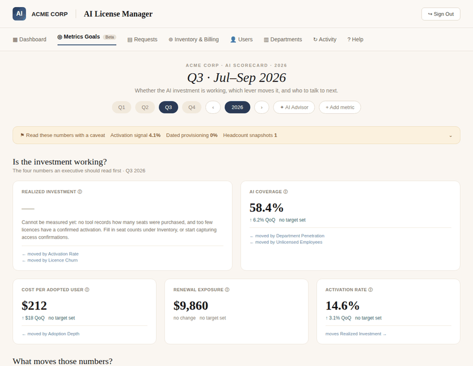
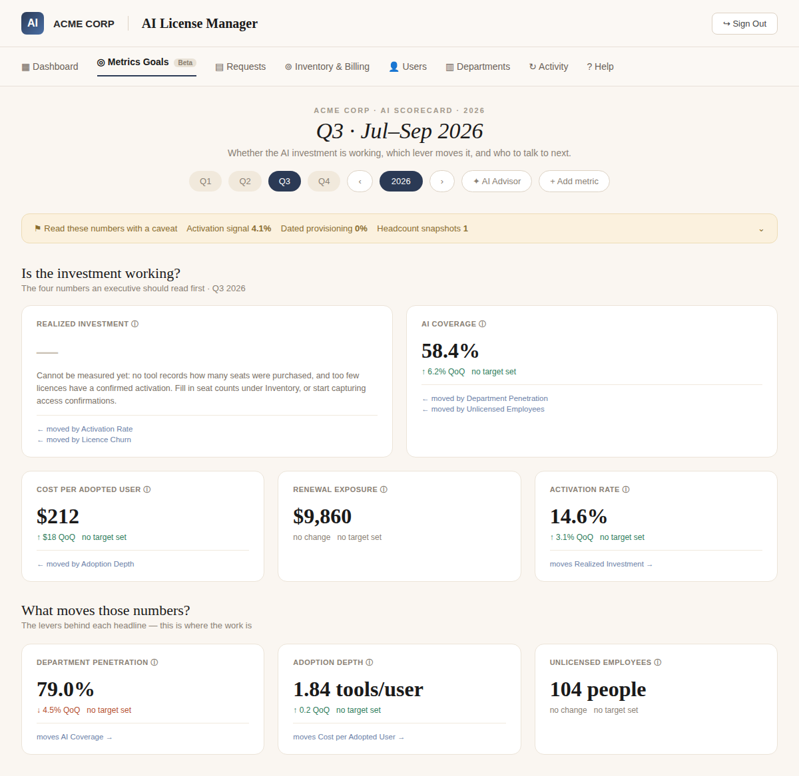
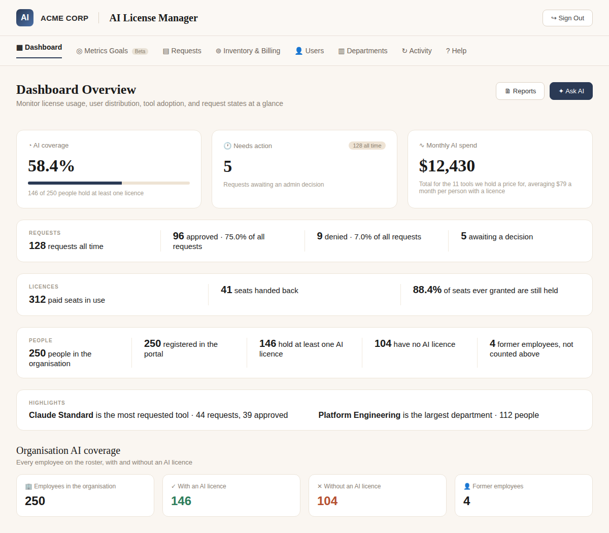
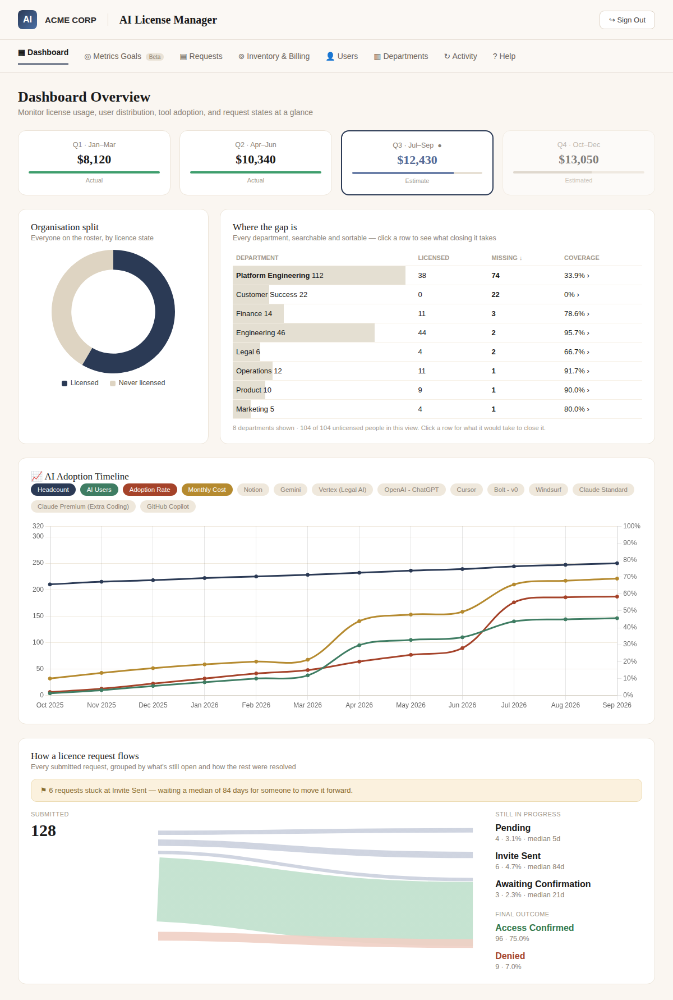
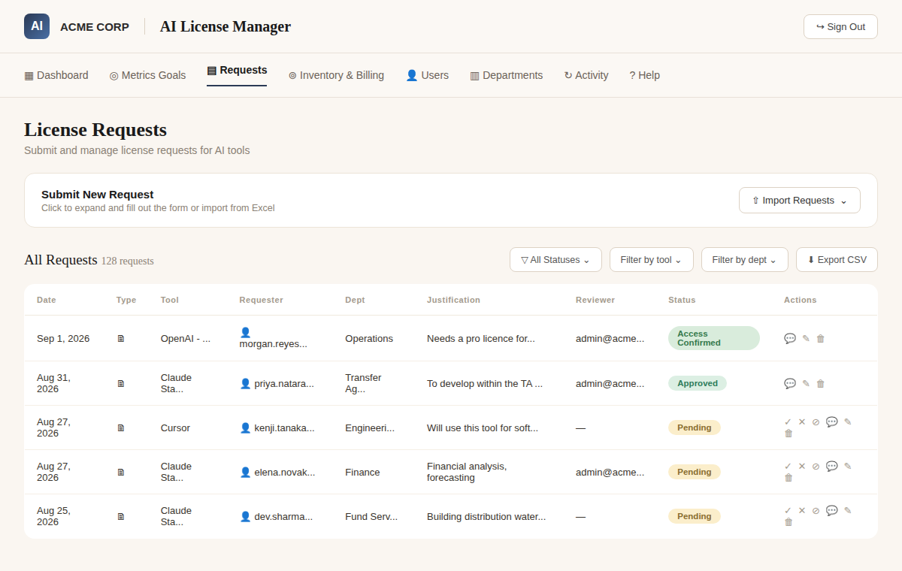

[← Back to profile](../../README.md)

# AI License Manager

**An internal platform for tracking, requesting, and governing AI tool access across an organization.**

## Overview

As companies adopt more AI tools (Claude, ChatGPT, Copilot, Cursor, and others), license sprawl becomes a real cost and compliance problem: nobody has a single view of who has access to what, how much the company is paying for idle seats, which departments are actually adopting the tools they're paying for, or how fast access requests get resolved. Spend tracking and access decisions end up scattered across spreadsheets, Slack threads, and vendor invoices.

AI License Manager centralizes all of that into one dashboard.

## Goals

- Give leadership a single, trustworthy view of AI tool spend and adoption instead of scattered spreadsheets.
- Turn "we probably have some idle seats" into a concrete, actionable list of reclaimable spend.
- Put a paper trail (requester, reviewer, justification, timestamp) behind every access grant for security and audit needs.
- Replace ad hoc Slack DMs to IT with a self-service request flow that has visible SLAs.

## Key Features

- **Dashboard Overview** — real-time view of AI coverage across the org (% of employees with at least one licence), total monthly AI spend, pending requests needing a decision, and rollups by department and tool.
- **License Requests** — a structured request/approval workflow: employees submit a tool + justification, admins approve/deny/confirm access, and every decision is logged with a reviewer and timestamp. Supports bulk import via CSV/Excel.
- **Metrics & Goals (AI Scorecard)** — a quarterly executive scorecard that goes beyond raw counts to answer "is the AI investment working?" It tracks leading and lagging indicators (activation rate, department penetration, adoption depth, cost per adopted user, renewal exposure) and explicitly shows which lever moves which headline metric — plus a built-in "AI Advisor" and data-quality caveats so leadership doesn't over-read noisy numbers.
- **Inventory & Billing** — tracks paid seats, idle/reclaimable spend by tool, and renewal exposure.
- **Users & Departments** — full roster view with license assignment, adoption gaps, deactivated users, and department-level penetration.
- **Activity log** — audit trail of every access change.

## Potential Use Cases

- IT/Ops teams governing AI tool rollout across a mid-size or enterprise org.
- Finance teams needing a defensible view of AI spend for budget reviews.
- Security/compliance teams needing an auditable access-grant trail.
- Department heads tracking their own team's tool adoption and coverage gaps.

## Screenshots

<table>
<tr>
<td width="50%"> AI Scorecard — quarterly executive view</td>
<td width="50%"> Dashboard Overview — coverage, spend, requests</td>
</tr>
<tr>
<td width="50%"> Full dashboard with org split &amp; adoption timeline</td>
<td width="50%"> License Requests — approval workflow</td>
</tr>
</table>

*Screenshots show the app with all data anonymized/fabricated for portfolio purposes.*

## How It's Used

1. An employee submits a license request for a specific AI tool with a justification.
2. An admin reviews the request in the Requests queue and approves, denies, or confirms access — the decision is logged with reviewer and timestamp.
3. The Dashboard and Inventory & Billing views update automatically, surfacing idle seats and reclaimable spend.
4. Each quarter, leadership reviews the AI Scorecard to see which levers (activation rate, adoption depth, department penetration) are actually moving usage and cost, with built-in caveats about data quality.

## Why It Matters

- **Cost control** — surfaces idle seats and reclaimable spend down to the dollar and the specific tool.
- **Governance & compliance** — every access grant has a requester, reviewer, and justification on record.
- **Executive visibility** — reframes tool adoption as a business metric (ROI, coverage, exposure) instead of a raw usage report.
- **Faster access** — self-service request flow with clear SLAs on pending decisions.

## Tech Stack

Full-stack internal web application with a dashboard-first UX (card-based KPIs, filterable tables, CSV import/export) and a lightweight "beta" analytics layer (the Scorecard) designed to evolve as data quality improves.

---

This is a private repository. [Contact me on LinkedIn](https://www.linkedin.com/in/daniel-shalom-13987a1a/) for a walkthrough or access.

[← Back to profile](../../README.md)
